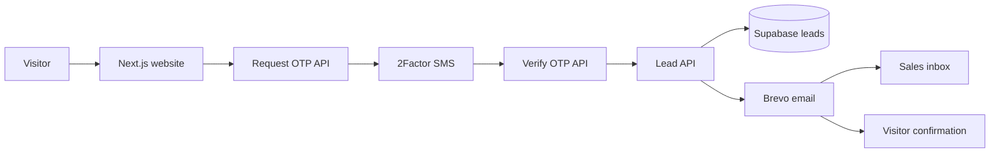

<div align="center">
  

  # Shivalik Présenté

  <a href="https://www.shivalikpresente.com/">
    
  </a>

  **[www.shivalikpresente.com](https://www.shivalikpresente.com/)**

  

  
  
  
  
</div>

## Overview

Shivalik Présenté is a production Next.js website for a collection of riverfront residences in GIFT City, Gandhinagar. The site includes the main project experience, SEO landing pages, editorial guides, enquiry capture, Indian mobile OTP verification, lead storage and transactional email delivery.

## Features

- Responsive project website with image-led sections and enquiry journeys
- Dedicated SEO pages for Shivalik Présenté, GIFT City and 4 BHK luxury apartment searches
- Server-rendered metadata, canonical URLs, Open Graph data and JSON-LD
- Dynamic `robots.txt`, XML sitemap and crawlable internal navigation
- FAQ content rendered visibly and included in structured data where appropriate
- Mobile OTP verification before a lead can be submitted
- Supabase lead storage with Row Level Security
- Brevo notifications for the sales team and enquiry confirmation for the visitor
- UTM attribution, referrer and source capture
- Optional GA4, Google Tag Manager and Meta Pixel integrations
- Automated favicon generation and a 42-URL SEO audit script

## Technology and services

| Service | Purpose | Used from |
| --- | --- | --- |
| Next.js 16 + React 19 | App Router website, static pages and server API routes | Entire application |
| TypeScript | Type-safe application code | `src/` |
| Tailwind CSS 4 + PostCSS | Styling toolchain | Global styles/build |
| Vercel | Hosting, deployments and server functions | Production |
| Supabase REST API | Stores verified enquiries in `public.leads` | `POST /api/leads` |
| Brevo Transactional Email API | Sends sales notifications and visitor confirmations | `POST /api/leads` |
| 2Factor OTP API | Sends and verifies Indian mobile OTP codes | `/api/otp/*` |
| Google Search Console | Domain verification and indexing monitoring | Metadata/environment |
| GA4 / GTM / Meta Pixel | Optional consent-aware analytics and marketing tracking | Client analytics |

No database or provider secret is sent to the browser. Supabase, Brevo, 2Factor and the OTP signing secret are read only inside server routes.

## Application flow



## API routes

| Method and route | Purpose | Main protection |
| --- | --- | --- |
| `POST /api/otp/request` | Validates a 10-digit Indian mobile number and requests an OTP from 2Factor | Provider timeout, input validation and signed HttpOnly pending cookie |
| `POST /api/otp/verify` | Verifies the OTP and creates a short-lived verified session | Signed HttpOnly cookies, matching phone/session and 10-minute expiry |
| `POST /api/leads` | Validates and delivers an enquiry to configured destinations | Same-origin check, payload limit, honeypot, field validation and verified OTP |

The lead route attempts every configured delivery destination. A submission succeeds when at least one active destination receives the lead, preventing an email outage from discarding a lead already stored in Supabase.

## Vercel environment variables

Add these in **Vercel → Project → Settings → Environment Variables**. Use **Production** for the live website and add them to **Preview** only when preview deployments also need working forms. Redeploy after adding or changing a variable.

### Public website configuration

| Variable | Required | Production value/purpose |
| --- | --- | --- |
| `NEXT_PUBLIC_SITE_URL` | Yes | `https://www.shivalikpresente.com` — canonical domain used by metadata, sitemap and structured data |
| `NEXT_PUBLIC_PHONE` | Recommended | Public click-to-call number, including country code |
| `NEXT_PUBLIC_WHATSAPP` | Recommended | WhatsApp number in digits-only international format |
| `NEXT_PUBLIC_CONTACT_EMAIL` | Recommended | Public contact email shown by the website |
| `NEXT_PUBLIC_GOOGLE_SITE_VERIFICATION` | For Search Console | Google verification token only, not the complete HTML tag |
| `NEXT_PUBLIC_GA4_ID` | Optional | Google Analytics measurement ID such as `G-XXXXXXXXXX` |
| `NEXT_PUBLIC_GTM_ID` | Optional | Google Tag Manager container ID such as `GTM-XXXXXXX` |
| `NEXT_PUBLIC_META_PIXEL_ID` | Optional | Meta Pixel ID |

Variables prefixed with `NEXT_PUBLIC_` are included in browser-delivered code. Never place private keys in them.

### Server-only lead delivery

| Variable | Required | Purpose |
| --- | --- | --- |
| `SUPABASE_URL` | Required for database storage | Supabase project URL |
| `SUPABASE_SERVICE_ROLE_KEY` | Required for database storage | Server-only service-role key used to insert leads |
| `BREVO_API_KEY` | Required for email delivery | Brevo transactional email API key |
| `BREVO_SENDER_EMAIL` | Required for email delivery | Sender address verified inside Brevo |
| `BREVO_SENDER_NAME` | Recommended | Display name used for outgoing email |
| `LEAD_ADMIN_EMAIL` | Required for notifications | Sales inbox that receives new enquiries |

At least Supabase or Brevo must be configured for lead delivery, although production should use both for redundancy. Apply [`supabase/migrations/20260907000000_create_leads.sql`](supabase/migrations/20260907000000_create_leads.sql) before enabling Supabase storage. The migration enables Row Level Security and intentionally exposes no public insert policy because writes use the server-only service role.

### Server-only OTP verification

| Variable | Required | Purpose |
| --- | --- | --- |
| `TWO_FACTOR_API_KEY` | Yes | API key from 2Factor for SMS OTP requests and verification |
| `OTP_SESSION_SECRET` | Yes | High-entropy secret used to sign pending and verified OTP cookies |

Generate `OTP_SESSION_SECRET` locally and save the generated value directly in Vercel:

```bash
openssl rand -base64 48
```

Do not commit this value. The repository ignores `.env.local` and all `.env*` files except `.env.example`.

## Local development

Requires Node.js 22 and npm.

```bash
git clone https://github.com/pikoruarealty/ShivalikPre.git
cd ShivalikPre
npm install
cp .env.example .env.local
npm run dev
```

Open [http://localhost:3000](http://localhost:3000). Populate `.env.local` with your own development credentials; never copy production secrets into source-controlled files.

## Commands

| Command | Description |
| --- | --- |
| `npm run dev` | Starts the Turbopack development server |
| `npm run build` | Creates the production build |
| `npm run start` | Serves the completed production build |
| `npm run lint` | Runs ESLint |
| `npm run typecheck` | Runs TypeScript checks without emitting files |
| `npm run icons:generate` | Rebuilds favicon and app-icon assets from the Shivalik logo source |
| `npm run seo:audit -- https://www.shivalikpresente.com` | Audits robots, sitemap, status, canonicals, metadata, H1s, JSON-LD and internal links |

## Project structure

```text
ShivalikPre/
├── public/
│   ├── images/                    # Project, Open Graph and brand assets
│   ├── favicon.ico
│   ├── apple-touch-icon.png
│   └── favicon-512.png
├── scripts/
│   ├── audit-seo.mjs             # Production/local crawl audit
│   └── generate-icons.mjs        # Favicon generation
├── src/
│   ├── app/
│   │   ├── api/
│   │   │   ├── leads/            # Lead delivery endpoint
│   │   │   └── otp/              # OTP request and verification
│   │   ├── insights/             # Editorial guides
│   │   ├── layout.tsx             # Global metadata and layout
│   │   ├── robots.ts
│   │   └── sitemap.ts
│   ├── components/
│   │   ├── forms/                # Lead and OTP interface
│   │   ├── layout/               # Header, footer and navigation
│   │   ├── sections/             # Homepage sections
│   │   └── seo/                  # SEO page UI and internal links
│   ├── data/                     # SEO pages, FAQs and insight content
│   └── lib/                      # Config, analytics, OTP, leads and schemas
├── supabase/migrations/           # Database schema
├── .env.example                   # Safe environment variable template
├── next.config.ts
└── package.json
```

## Deployment checklist

1. Import `pikoruarealty/ShivalikPre` into Vercel and keep the repository root as the Root Directory.
2. Use the detected Next.js preset, Node.js 22 and the default `npm run build` command.
3. Add the environment variables listed above without exposing server-only secrets.
4. Add both `shivalikpresente.com` and `www.shivalikpresente.com`, then keep `https://www.shivalikpresente.com` as the canonical production domain.
5. Apply the Supabase migration and verify the Brevo sender before testing enquiries.
6. Deploy, test OTP and lead delivery, then check `/robots.txt`, `/sitemap.xml` and `/favicon.ico`.
7. Submit `https://www.shivalikpresente.com/sitemap.xml` in Google Search Console and request indexing for representative pages.

## Security notes

- Never commit `.env.local`, API keys, service-role keys or OTP secrets.
- Rotate a credential immediately if it is exposed in Git history, screenshots or logs.
- Keep the Supabase service-role key server-only; it bypasses Row Level Security.
- The OTP session uses signed, HttpOnly, SameSite cookies with a 10-minute expiry.
- Analytics should be enabled only with the consent approach required for the deployment.

## Quality checks

Before production deployment, run:

```bash
npm run lint
npm run typecheck
npm run build
npm run seo:audit -- https://www.shivalikpresente.com
```

Technical SEO makes pages accessible and understandable to crawlers, but indexing positions and keyword rankings remain search-engine decisions and cannot be guaranteed.

---

<div align="center">
  Built for <a href="https://www.shivalikpresente.com/">Shivalik Présenté</a> in GIFT City, Gandhinagar.
</div>
